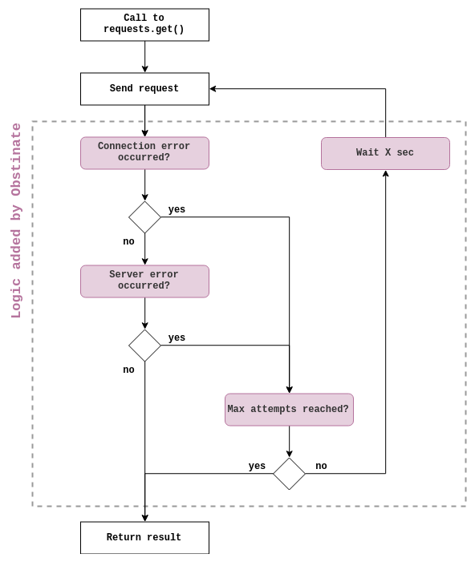

# 

Obstinate is a python 3 snippet wrapping the [requests](https://github.com/kennethreitz/requests) library.

Obstinate automaticaly replays a request when a connection error occurs, or when the status code returned by the server is not the expected one. Obstinate is meant to be used with minimum code modification, working in the exact same way as *requests*.

**Why / when to use Obstinate?**

When you want to send a request through Internet but you have an instable connexion, or when the server you query is busy, you sometimes need to replay multiple times the request before it works. For instance, this often happens when you want to grab data from a public API or when you do webscrapping.

However, if the connection between your application and the remote server is critical, you'd better to implement a tailor-made solution in order to handle edge case scenarios.

## Getting Started

### Installation

First, install obstinate into your python environment:

```bash
python -m pip install git+https://github.com/benjamindelmee/obstinate-requests
```

### Usage

Obstinate adds the `obstinate.oget()` method to the *requests* library.

```python
import obstinate as requests

url = 'https://www.google.com'

# make the request with oget() instead of get()
res = requests.oget(url)

# For status codes 418, 500, 501, 502 (etc.) the script will try up to
# 5 times to get a different response from the server
res = requests.oget(url, o_max_attempts=5, o_status_forcelist=['418', '5xx'])

# if needed, you still have access to the original and unmodified
# requests.get() method
res = requests.get(url)
```

## Detailled workflow

- A **connection error** occurs when the server is unreachable.
- A **server error** occurs when the server returned an unwanted status code. With the argument `o_status_forcelist`, you can specify a list of status codes that, if sent by the server, will force the script to send the request again. 

The script will never send more than `o_max_attempts + 1` queries for a given URL. You can specify the sleep time between each attempt with the parameter `o_sleep_time` (in second).


